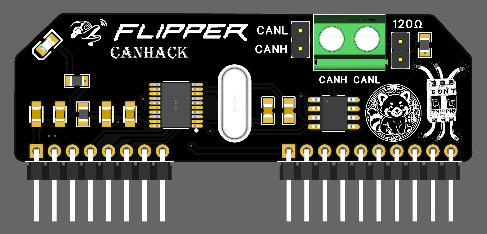

# flipper-CANHACK

使用 flipper 对 UDS 进行自动化测试，flipper zero 通过扩展板外接 MCP2515、TJA1050 实现 CAN 协议收发，可使用 UDS 协议进行 ECU 存活扫描、服务探测、DID 爆破、安全访问算法测试等

参考：

硬件参考自：https://github.com/yasir-shahzad/MCP2515-CAN-Bus-Module

软件参考自：https://github.com/ElectronicCats/flipper-MCP2515-CANBUS
