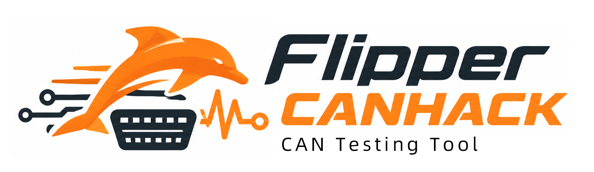
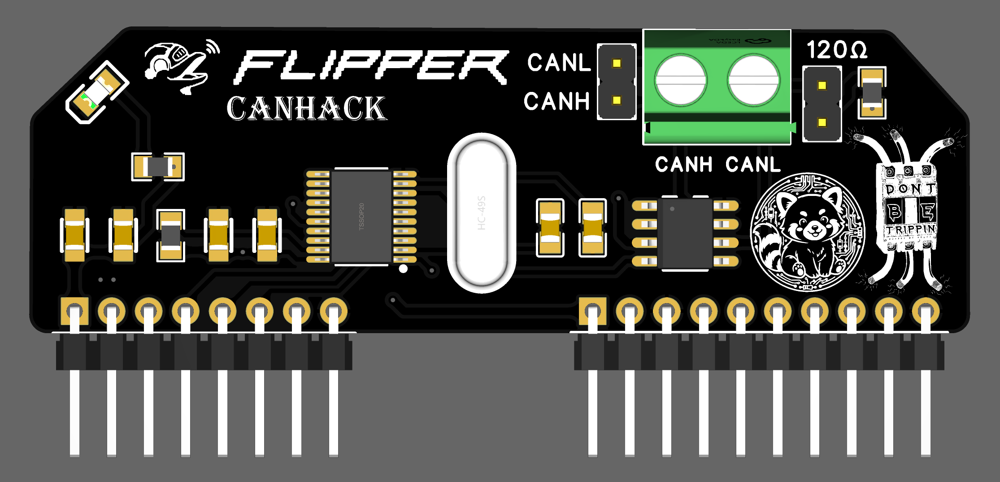
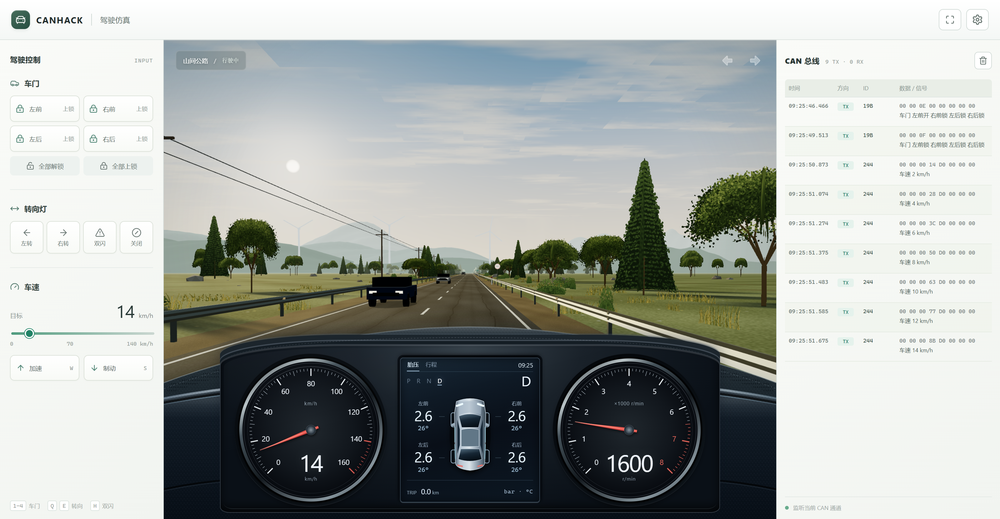

# flipper-CANHACK



使用 flipper 对 UDS 进行自动化测试，flipper zero 通过扩展板外接 MCP2515、TJA1050 实现 CAN 协议收发，可使用 UDS 协议进行 ECU 存活扫描、服务探测、DID 爆破、安全访问算法测试等




附带一个演示环境，创建一个 CAN 总线，通过 PCAN 进行监听，也可通过 ESP32+CC1101 实现胎压信号的接收和发射（TPMS 部分暂不开源）



```
hardware 文件夹为硬件电路实现
software 文件夹 CanHACK 为 Flipper CANHACK APP 代码
		cluster_demo 为演示环境源码，双击 run_demo.bat 自动打开浏览器
		parse_allinone_report.py 是解析报告的脚本
```


参考：

硬件参考自：https://github.com/yasir-shahzad/MCP2515-CAN-Bus-Module

软件参考自：https://github.com/ElectronicCats/flipper-MCP2515-CANBUS
